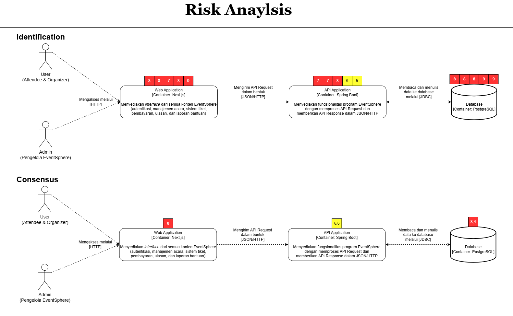

# Advanced Programming Group Project 2024/2025 - A11

## Context Diagram
    

## Container Diagram

## Deployment Diagram

## Risk Analyzing

## New Future Software Architecture

Modifikasi ini bertujuan untuk meningkatkan ketahanan sistem terhadap ancaman yang mungkin terjadi di masa depan, seperti penurunan performa, kerentanannya terhadap serangan, atau ketidaksesuaian dengan perkembangan teknologi yang lebih baru. Jika analisis risiko menunjukkan bahwa sistem lama kurang mampu menangani beban transaksi yang meningkat, modifikasi arsitektur bisa mencakup peningkatan kapasitas atau penggunaan teknologi yang lebih canggih, seperti komputasi awan, untuk mengatasi masalah skalabilitas. Modifikasi ini diharapkan dapat mengoptimalkan kinerja sistem dan memastikan keberlanjutan operasional yang lebih aman dan efisien.