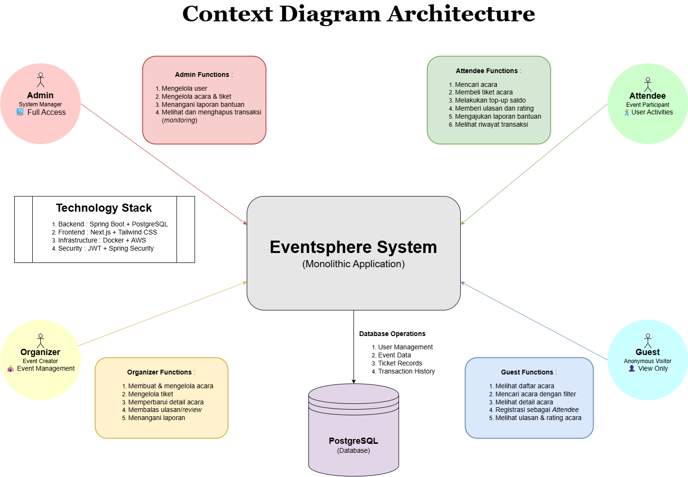
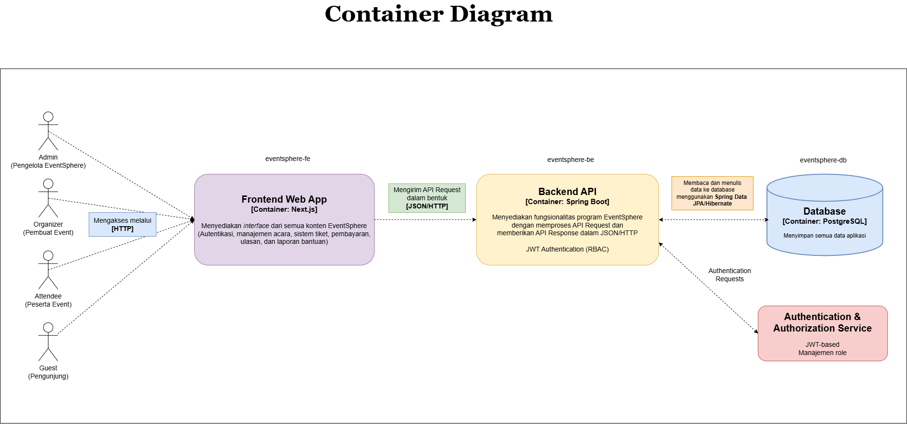
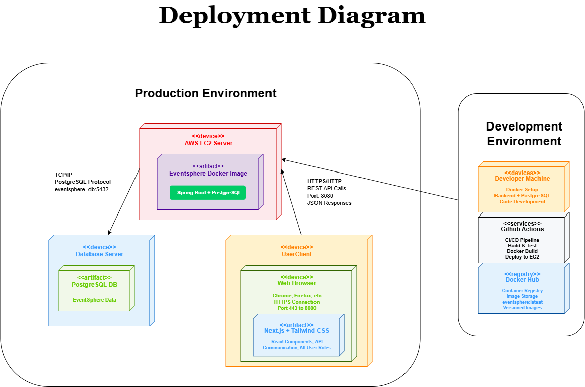
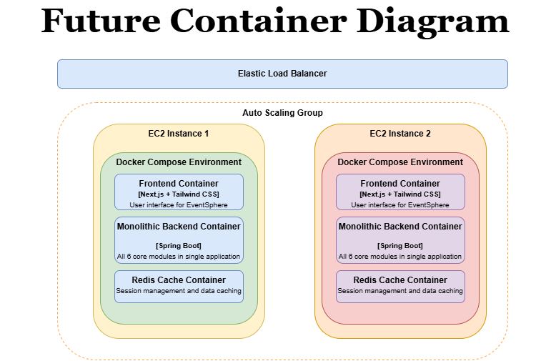
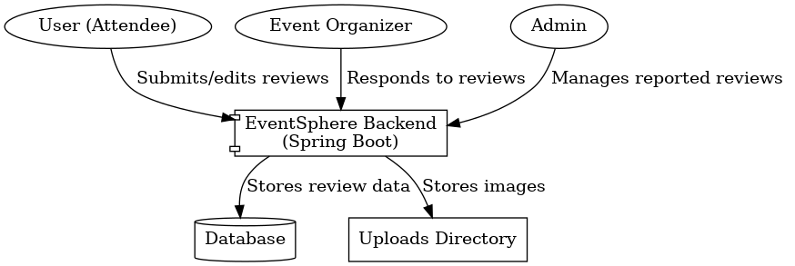
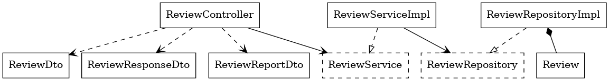
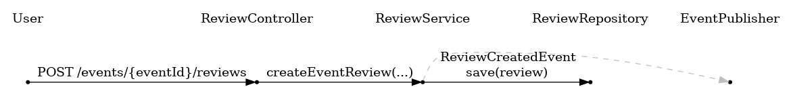
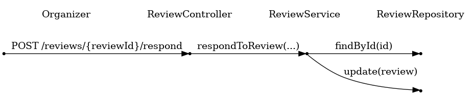
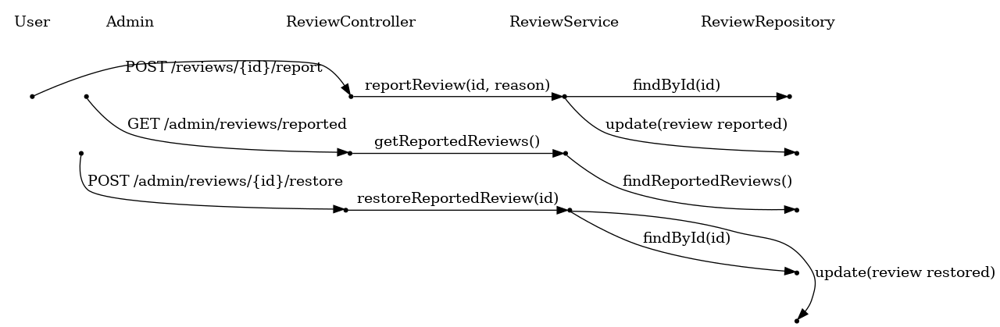

# Advanced Programming Group Project 2024/2025 - A11

## 👥 Nama Anggota Kelompok A11 👥
* [Patricia Herningtyas](https://github.com/patriciatyas) - 2306152241
* [Muhammad Almerazka Yocendra](https://github.com/almerazka) - 2306241745
* [Erdafa Andikri](https://github.com/dafandikri) - 2306244974
* [Calvin Joy Tarigan](https://github.com/cjoyy) - 2306244974
* [Caressa Putri Yuliantoro](https://github.com/caressapy) - 2206081742

## 💡 Daftar Modul Aplikasi 💡
#### 1. Authentication (🙋 / 💻 / 🕺 ) (Patricia Herningtyas & Muhammad Almerazka Yocendra)
#### 2. Manajemen Acara (🙋 / 💻 / 🕺 / 👤) (Calvin Joy Tarigan)
#### 3. Sistem Tiket (🙋 / 💻 / 🕺) (Caressa Putri Yuliantoro)
#### 4. Manajemen Pembayaran dan Saldo ( 💻 / 🕺) (Patricia Herningtyas)
#### 5. Ulasan dan Peringkat Acara (🙋 / 💻 / 🕺 / 👤) (Erdafa Andikri)
#### 6. Laporan dan Pengajuan Bantuan (🙋 / 💻 / 🕺) (Muhammad Almerazka Yocendra)

## Context Diagram
    

## Container Diagram


## Deployment Diagram


## Risk Analyzing


## New Future Software Architecture


>> Modifikasi ini bertujuan untuk meningkatkan ketahanan sistem terhadap ancaman yang mungkin terjadi di masa depan, seperti penurunan performa, kerentanannya terhadap serangan, atau ketidaksesuaian dengan perkembangan teknologi yang lebih baru. Jika analisis risiko menunjukkan bahwa sistem lama kurang mampu menangani beban transaksi yang meningkat, modifikasi arsitektur bisa mencakup peningkatan kapasitas atau penggunaan teknologi yang lebih canggih, seperti komputasi awan, untuk mengatasi masalah skalabilitas. Modifikasi ini diharapkan dapat mengoptimalkan kinerja sistem dan memastikan keberlanjutan operasional yang lebih aman dan efisien.

(Deliverable Group Tutorial Module 9 dibuat oleh Patricia Herningtyas dan Muhammad Almerazka Yocendra)

## Event Management Architecture Overview

#### Controller Layer
- EventController.java: Menangani endpoint API REST untuk semua operasi terkait event termasuk pembuatan, pembaruan, penampilan, dan penghapusan.

### Service Layer
- Mengimplementasikan logika bisnis dengan interface dan implementasi (mengikuti praktik desain yang baik)
- EventService/Impl: Mengelola logika bisnis untuk operasi event

### Repository Layer
- EventRepository.java: Menangani operasi akses data untuk entitas Event
- UserRepository.java: Mengelola data pengguna yang diperlukan untuk asosiasi event

### DTO Layer
- EventCreateDTO.java: Berisi data yang diperlukan untuk membuat event baru
- EventResponseDTO.java: Memformat data event untuk respons API
- EventUpdateDTO.java: Menangani permintaan pembaruan event
- UserSummaryDTO.java: Berisi informasi pengguna minimal untuk asosiasi event

### Exception Layer
- EventNotFoundException.java: Exception khusus saat event tidak dapat ditemukan
- GlobalExceptionHandler.java: Penanganan exception terpusat untuk respons error yang konsisten
- UnauthorizedAccessException.java: Menangani percobaan modifikasi event yang tidak sah

### Model Layer
- Event.java: Entitas inti event dengan properti seperti judul, deskripsi, tanggal, tempat, dan harga
- User.java: Entitas pengguna untuk asosiasi dengan event (informasi penyelenggara)
- UserRole.java: Enum yang mendefinisikan peran pengguna yang berbeda dan izin mereka

### Design Pattern
1. **Repository Pattern**: 
   - Memisahkan logika akses data dari logika bisnis
   - Mengenkapsulasi operasi database untuk entitas Event

2. **Service Layer Pattern**: 
   - Berisi semua logika bisnis untuk operasi event
   - Mengelola transaksi dan memvalidasi aturan bisnis

3. **DTO Pattern**:
   - Memisahkan representasi API dari model domain
   - Mengontrol eksposur dan validasi data

4. **MVC Pattern**:
   - Memisahkan konsep antara model (data event), controller, dan view (respons API)

5. **Exception Handling Pattern**:
   - Menyediakan respons error yang konsisten melalui GlobalExceptionHandler
   - Menggunakan exception spesifik untuk skenario error yang berbeda

### Kemampuan Fitur
- Penyelenggara dapat membuat event baru dengan informasi detail
- Semua pengguna dapat melihat event yang tersedia
- Penyelenggara dapat memperbarui event mereka sendiri sebelum tenggat waktu tertentu
- Penyelenggara dapat menghapus event yang telah mereka buat

### Component Event Management


### Code Diagram Event Management


---

## 🎫 Ticket System Architecture Overview

### 🧩 Controller Layer

* **TicketController.java**: Menangani seluruh endpoint API yang berkaitan dengan tiket, seperti:

  * `addTicket`: Menambahkan tiket baru oleh organizer
  * `updateTicket`: Mengubah informasi tiket oleh organizer
  * `deleteTicket`: Menghapus tiket oleh admin
  * `getAvailableTickets`: Untuk melihat semua tiket

### 🧠 Service Layer

* Mengimplementasikan logika bisnis dengan menerapkan pola desain interface-implementasi.
* **TicketService.java**: Interface utama untuk mendefinisikan kontrak bisnis terkait tiket.
* **TicketServiceImpl.java**:

  * Memverifikasi peran pengguna sebelum memproses permintaan
  * Mengelola transaksi tiket (create, update, delete, read)
  * Menerapkan logika tambahan untuk validasi kuota, otorisasi, dan integrasi dengan entitas Event

### 🗃 Repository Layer

* **TicketRepository.java**:

  * Mengakses dan memodifikasi data `Ticket` dalam database
  * Turunan dari `JpaRepository` untuk operasi CRUD
    
* **TicketCategory**:

  * Enum yang menggambarkan kategori tiket (REGULAR dan VIP)

### 📦 DTO (Data Transfer Object) Layer

* **TicketRequest.java**:

  * Digunakan untuk menerima data dari client saat pembuatan atau pembaruan tiket.

* **TicketResponse.java**:

  * Digunakan untuk mengirimkan data tiket ke client.
  * Menggunakan **Builder Pattern** untuk konstruksi objek yang fleksibel dan terstruktur.

### ❗ Exception Layer

* **TicketNotFoundException.java**:

  * Dilempar saat tiket yang diminta tidak ditemukan dalam database.

* **UnauthorizedAccessException.java**:

  * Dilempar saat user mencoba melakukan operasi yang tidak diizinkan sesuai perannya.

### 🧱 Model Layer

* **Ticket.java**:

  * Representasi entitas tiket dalam database.
  * Memiliki relasi dengan entitas Event.

* **TicketCategory.java**:

  * Enum yang mendeskripsikan tipe/kategori dari tiket.
  * Contoh: `REGULAR` dan `VIP`

---

## 🧰 Design Pattern: Builder Pattern

Builder Pattern digunakan dalam `TicketResponse` untuk:

* Membangun objek secara fleksibel ketika field-nya banyak
* Memisahkan logika pemetaan dari entitas → DTO
* Menjaga prinsip **Single Responsibility Principle (SRP)**
* Meningkatkan **readability**, **testability**, dan **maintainability** kode

---

## ✅ Kemampuan Fitur

* **Attendee**, **Organizer**, dan **Admin** dapat:

  * Melihat semua tiket yang tersedia
* **Organizer** dapat:

  * Menambahkan tiket ke event-nya
  * Mengubah informasi tiket
* **Admin** dapat:

  * Menghapus tiket yang bermasalah atau tidak valid

### Component Ticket System
[https://ristek.link/component-ticket-system](https://ristek.link/component-ticket-system)

### Code Diagram Ticket System
[https://ristek.link/code-diagram-ticket-system](https://ristek.link/code-diagram-ticket-system)

---

## Payment and Balance Management Architecture Overview

#### Controllers Layer
- TopUpController: Handles REST API endpoints for top-up operations and balance queries
- TransactionController: Manages endpoints for ticket purchases and transaction history

### Service Layer
- Implements business logic with interfaces and implementations (following good design practices)
- TopUpService/Impl: Manages wallet top-up operations
- TransactionService/Impl: Handles ticket purchases and transaction management

### Design Patterns Used
1. Strategy Pattern:
    - TopUpStrategy interface with StandardTopUpStrategy implementation
    - Allows for flexible top-up behavior that can be changed at runtime

2. Factory Pattern:
    - TopUpFactory creates different types of top-ups (Fixed or Custom)
    - Encapsulates creation logic and provides preset top-up amounts

3. DTO Pattern:
    - Clean separation of data transfer objects from domain models
    - Examples: TopUpRequestDTO, TopUpResponseDTO, TransactionDTO

### Component Diagram Payment and Balance Management


### Code Diagram Diagram Payment and Balance Management

## [Muhammad Almerazka Yocendra](https://github.com/almerazka) - 2306241745

### Laporan dan Pengajuan Bantuan (🙋 / 💻 / 🕺) 

#### Component Diagram


#### Code Diagram


# EventSphere - Review & Helpdesk Management Module

## Review Management Architecture Overview

This module implements a feature-focused structure following SOLID principles and using the Observer pattern for event handling. The review system allows users to create reviews for events, calculates average ratings, and notifies relevant components about new reviews.

## Package Structure

The review module follows a package-by-feature approach:

```
id.ac.ui.cs.advprog.eventsphere/
└── review/
    ├── controller/       # REST endpoints for review operations
    ├── service/          # Business logic for review functionality
    ├── repository/       # Data access for review persistence
    ├── model/            # Domain entities
    ├── dto/              # Data Transfer Objects
    ├── event/            # Event objects for the Observer pattern
    └── listener/         # Event listeners implementing the Observer pattern
```

## Architecture Layers

### Controllers Layer

- **ReviewController**: Handles REST API endpoints for creating reviews, retrieving reviews by event, and getting average ratings.

### Service Layer

- **ReviewService**: Interface defining the contract for review operations
- **ReviewServiceImpl**: Implementation that integrates with authentication and publishes events

### Repository Layer

- **ReviewRepository**: JPA repository with custom query for calculating average ratings

### Model/Entity Layer

- **Review**: Entity representing a user review with rating, content, user reference, and event ID

### Event System (Observer Pattern)

- **ReviewCreatedEvent**: Event published when a review is created
- **EventRatingUpdateListener**: Listener that recalculates and updates event ratings
- **ReviewNotificationListener**: Listener that sends notifications about new reviews

## Design Patterns Used

### Observer Pattern

The Observer pattern is the core design pattern used in the Review module, implemented using Spring's event mechanism:

1. **Subject (Publisher)**: The `ReviewServiceImpl` publishes `ReviewCreatedEvent` when a new review is created
2. **Observers (Listeners)**:
    - `EventRatingUpdateListener`: Recalculates average event ratings
    - `ReviewNotificationListener`: Sends notifications about new reviews

### DTO Pattern

- Clean separation between API contracts and internal domain models
- **ReviewRequest**: Validates incoming review data with constraints

### Repository Pattern

- Abstracts data access through the Spring Data JPA repository
- Includes custom query methods for specialized data retrieval

### Container Diagram



### Class Diagram



### Sequence Diagram: User Creates a Review



### Sequence Diagram: Organizer Responds to a Review



### Sequence Diagram: Admin Reviews Reports (Report/Restore)



## Conclusion

The Review module demonstrates a well-structured, maintainable design using the Observer pattern to handle complex interactions between components while maintaining loose coupling. This approach enables the system to evolve with new requirements while minimizing changes to existing code.


Penerapan Software Architectures
