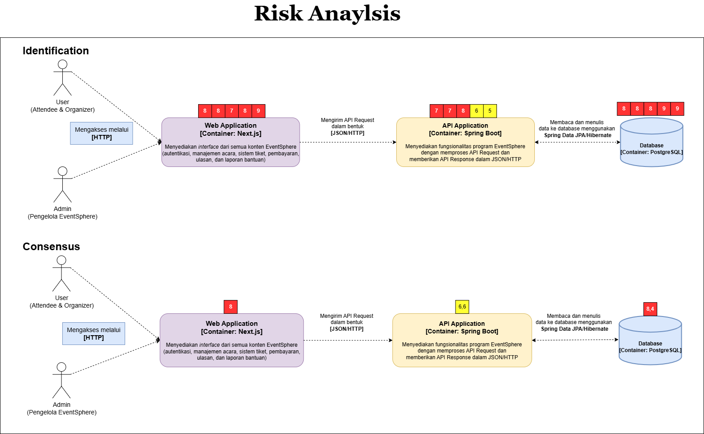

# Advanced Programming Group Project 2024/2025 - A11

## 👥 Nama Anggota Kelompok A11 👥
* [Patricia Herningtyas](https://github.com/patriciatyas) - 2306152241
* [Muhammad Almerazka Yocendra](https://github.com/almerazka) - 2306241745
* [Erdafa Andikri](https://github.com/dafandikri) - 2306244974
* [Calvin Joy Tarigan](https://github.com/cjoyy) - 2306244974
* [Caressa Putri Yuliantoro](https://github.com/caressapy) - 2206081742

## 💡 Daftar Modul Aplikasi 💡
#### 1. Authentication (🙋 / 💻 / 🕺 ) (Patricia Herningtyas & Muhammad Almerazka Yocendra)
#### 2. Manajemen Acara (🙋 / 💻 / 🕺 / 👤) (Calvin Joy Tarigan)
#### 3. Sistem Tiket (🙋 / 💻 / 🕺) (Caressa Putri Yuliantoro)
#### 4. Manajemen Pembayaran dan Saldo ( 💻 / 🕺) (Patricia Herningtyas)
#### 5. Ulasan dan Peringkat Acara (🙋 / 💻 / 🕺 / 👤) (Erdafa Andikri)
#### 6. Laporan dan Pengajuan Bantuan (🙋 / 💻 / 🕺) (Muhammad Almerazka Yocendra)

## Context Diagram
    

## Container Diagram

## Deployment Diagram

## Risk Analyzing

## New Future Software Architecture

>> Modifikasi ini bertujuan untuk meningkatkan ketahanan sistem terhadap ancaman yang mungkin terjadi di masa depan, seperti penurunan performa, kerentanannya terhadap serangan, atau ketidaksesuaian dengan perkembangan teknologi yang lebih baru. Jika analisis risiko menunjukkan bahwa sistem lama kurang mampu menangani beban transaksi yang meningkat, modifikasi arsitektur bisa mencakup peningkatan kapasitas atau penggunaan teknologi yang lebih canggih, seperti komputasi awan, untuk mengatasi masalah skalabilitas. Modifikasi ini diharapkan dapat mengoptimalkan kinerja sistem dan memastikan keberlanjutan operasional yang lebih aman dan efisien.

(Deliverable Group Tutorial Module 9 dibuat oleh Patricia Herningtyas dan Muhammad Almerazka Yocendra)